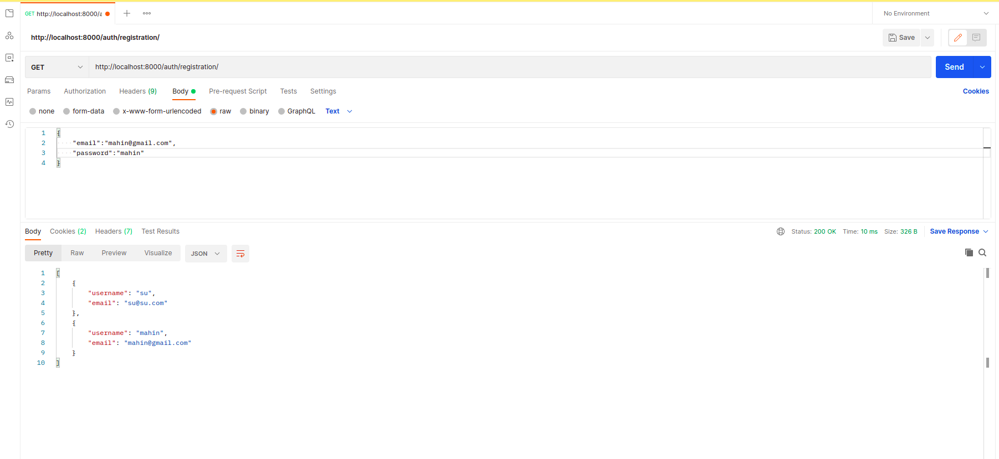
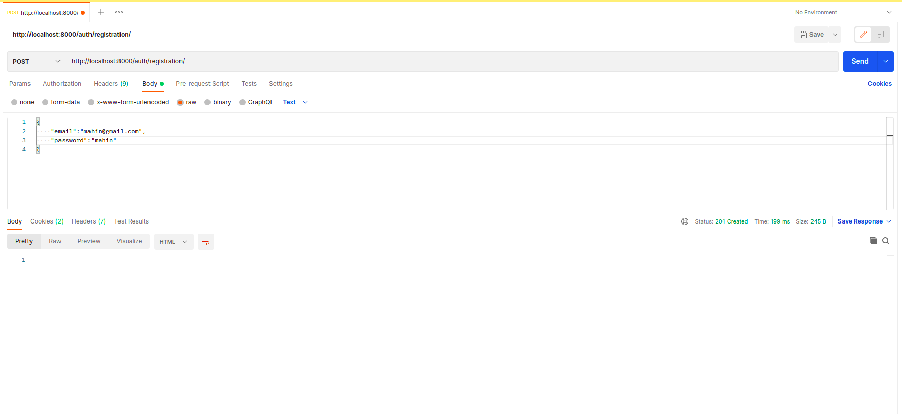
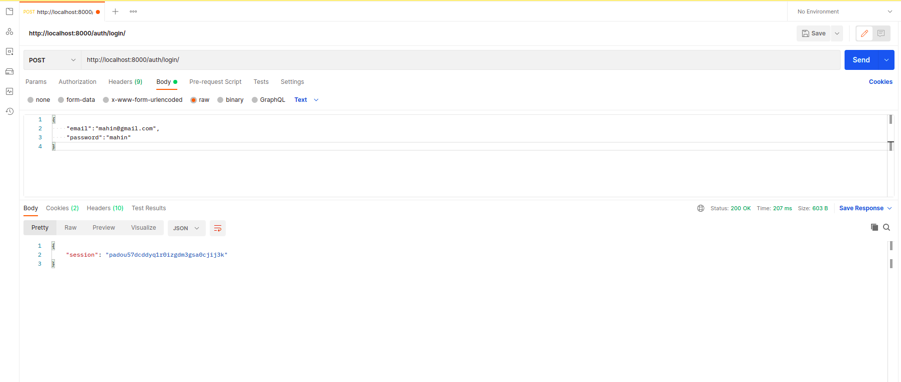
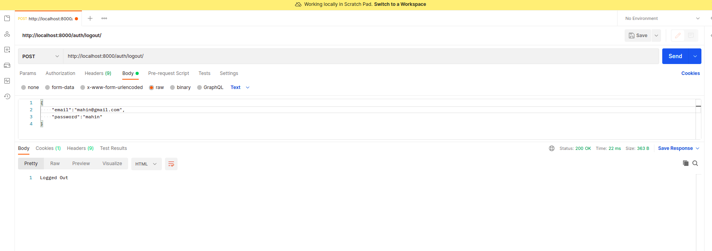
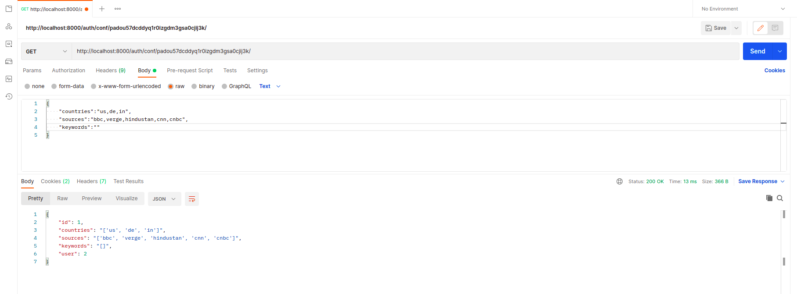
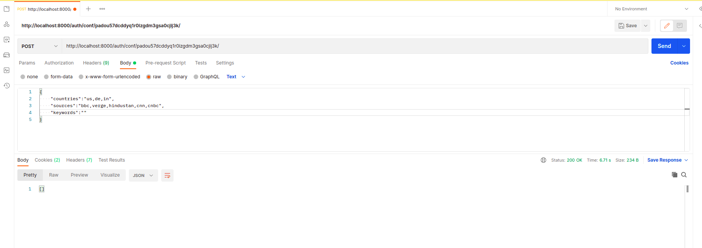
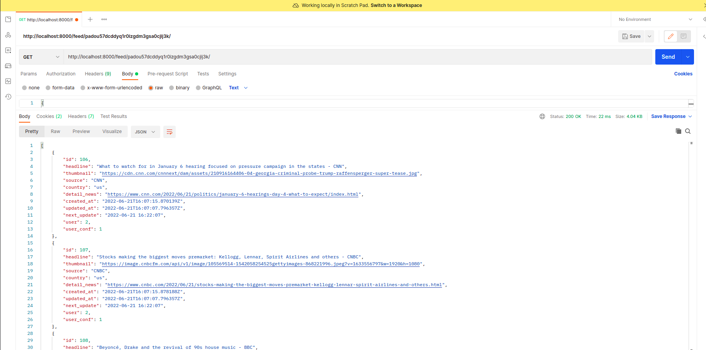
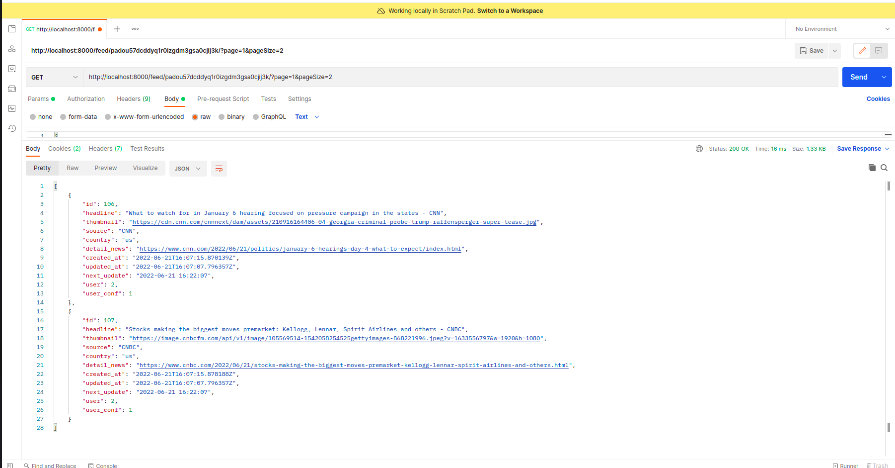

# NewsAPI with Django


### Do perform these operations first...
```sh
a. Clone the project repository.
```
```sh
b. Checkout to the master branch.
```
```sh
c. Create a Virtual Environment.
```
```sh
d. Activate Virtual Environment.
```
```sh
e. Install dependencies/libraries from requirements.txt file.
```

### API Endpoints

##### REGISTRATION
```sh
http://localhost:8000/auth/registration/ -[GET, POST]


[GET] - Get all the registered users.
[POST] - Post for user registration. Format
{
    "email": "admin@admin.com",
    "password": "admin"
}
```
##### [GET]


##### [POST]


**The system will automatically split the email by '@' and will create the username with the first portion of the email.**


##### LOGIN
```sh
http://localhost:8000/auth/login/ -[POST]


[POST] - For user login. Format
{
    "email": "admin@gmail.com",
    "password": "admin"
}
```
##### [GET]


**After a successful login the system will return a session key using which the user will perform further actions. Make sure you are saving this session key.**

##### LOGOUT
```sh
http://localhost:8000/auth/logout/ -[POST]


[POST] - For logout just simply make a POST request in this URL. No parameters need to be passed here.
```
##### [POST]


##### USER CONFIGURATION
```sh
http://localhost:8000/auth/conf/<str:session>/ -[GET, POST]


[GET] - Get request for seeing the user configurations.
[POST] - For creating user configuration. Format:
{
    "countries": "us,in,de",  #data should be comma-separated without any space.
    "sources": "bbc,verge,cnn", #just pass the source name. no need to add any special symbol e.g bbc-news.
    "keywords": "bitcoin,covid"

}
```

##### [GET]

##### [POST]


**After making a successful POST request in the following URL with these params, a user configuration file will be created as his topics of interest. Later on, only news related to these configs will be visible for that specific user.**
*NB: Do not forget to put the session code at the end of the URL.*


##### NEWS FEED
```sh
http://localhost:8000/feed/<str:session>/ -[GET]


[GET] - User will see his newsfeed after by making a GET request. The URL should contain the session code as well. For the first request, it may take a few time to fetch all the data from the API server.
```
##### [GET]



##### NEWS FEED PAGINATION
```sh
http://localhost:8000/feed/<str:session>/?page=n&pageSize=n  -[GET]


To fetch data using pagination user need to pass two params at the and of the url. page params means the page number and pageSize means the maximum content in a single page.
```
##### [GET]



## ABOUT THE SCHEDULER
**A scheduler has been created in the project that will trigger in every 12 minutes to get the latest news for each user. After starting the project you must start the scheduler but hitting this URL - http://localhost:8000/scheduler/start/ . It may take more times based on the interned speed or your pc configuration sometimes.**


